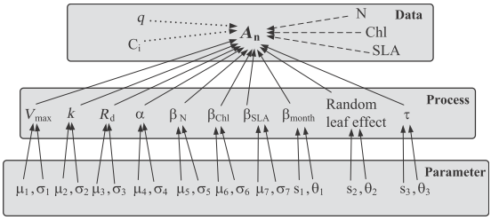

# 写在前面的话 {#pre-bayes}

贝叶斯统计诞生的很早，历史无需我来回顾，但其发明者 Thomas Bayes 的理论在他死后才发表，初期籍籍无名（历史总是相似的，也有这个需要的计算量非常大有关系），后来被一个医学统计学家发扬光大，直至近些年来随着火热的机器学习浪潮大活特火，但对于非数学或统计出身的人来讲，网上的资料无异于天书版难懂，至少对我如此。在经过断断续续一年多的资料阅读后，渐渐明白了点，特别是读了 @rethinking2015 的大作后，似乎有窗户纸即将捅破的感觉，于是特作此文，希望能有所得。

# 什么是贝叶斯统计 {#what-bayes}

这个维基百科用最简单通俗我们都理解的方式写了出来，简单描述如下：

>我们已经非常熟悉“正向概率”，如“假设袋子里面有N个白球，M个黑球，你伸手进去摸一把，摸出黑球的概率是多大”。而一个自然而然的问题是反过来：“如果我们事先并不知道袋子里面黑白球的比例，而是闭着眼睛摸出一个（或好几个）球，观察这些取出来的球的颜色之后，那么我们可以就此对袋子里面的黑白球的比例作出什么样的推测”。这个问题，就是所谓的逆概问题。

## 一个别人的例子 {#bayes-exam}

如果让我从头编一个例子我实在有心无力，但网络是伟大的，想详细看的同学点击这里：[yankun's blog](http://www.xuyankun.cn/2017/05/13/bayes/)，这里我摘抄总结一下，好保持文章的的连贯和完整性：

>  一种癌症，得了这个癌症的人被检测出为阳性的几率为90%，未得这种癌症的人被检测出阴性的几率为90%，而人群中得这种癌症的几率为1%，一个人被检测出阳性，问这个人得癌症的几率为多少？
猛地一看，被检查出阳性，而且得癌症的话阳性的概率是90%，那想必这个人应该是难以幸免了。那我们接下来就算算看。

>我们用 A 表示事件 “测出为阳性”, 用 B1 表示“得癌症”, B2 表示“未得癌症”。根据题目，我们知道如下信息:

\begin{equation}
P(A|B_{1}) = 0.9, P(A|B_{2}) = 0.1, P(B_{1}) = 0.01, P(B_{2}) = 0.99
(\#eq:pab1)
\end{equation}

如果高中数学部分没有完全还给老师的话，这部分内容很好理解，就是上面这段话的数学表达。

>那么我们现在想得到的是已知为阳性的情况下，得癌症的几率 P(B1,A)：

\begin{equation}
P(B_{1},A) = P(B_{1}) \cdot P(A|B_{1}) = 0.01 \times 0.9 = 0.009
(\#eq:pb1a)
\end{equation}

结果也就是相互独立的两个事件的概率同时发生：得癌症的概率乘以阳性得癌症的概率，上面的结果告诉我们，如果去医院检查出某项指标为阳性先不要怕（知识就是力量）。当然医院也不可能仅按照此一项标准，还要结合一系列其他手段来判定，**因此不要因为我们这个片面的例子而对医院有误解**。

>这里 P(B1,A) 表示的是联合概率，是0.009。同理可得出未得癌症且检测出阳性的概率：

\begin{equation}
P(B_{2},A) = P(B_{2}) \cdot P(A|B_{2}) = 0.99 \times 0.1 = 0.099
(\#eq:pb2a)
\end{equation}

>这个概率是什么意思呢？其实是指如果人群中有1000个人，检测出阳性并且得癌症的人有9个，检测出阳性但未得癌症的人有99个。可以看出，检测出阳性并不可怕，不得癌症的是绝大多数的，这跟我们一开始的直觉判断是不同的！可直到现在，我们并没有得到所谓的“在检测出阳性的前提下得癌症的概率（即已经检测出阳性） ”，怎么得到呢？很简单，就是看被测出为阳性的这108 (9+99) 个人里，9人和99人分别占的比例就是我们要的,也就是说我们只需要添加一个归一化因子(normalization)就可以了。所以阳性得癌症的概率:

\begin{equation}
P(B_{1}|A) = \frac{0.009}{0.099 + 0.009} \approx 0.083
(\#eq:pb1a1)
\end{equation}

当然，尽管这种用概率表示的方式十正确，但对于我来讲还是不好理解，用我们常规的计算方法则可表示为：

\begin{equation}
P(B_{1}|A) = \frac{9}{99 + 9} \approx 0.083
(\#eq:pb1a11)
\end{equation}

也就是说虽然检测结果为阳性，但确诊的有 9 人，误报有 99 人，那么最终阳性得癌的几率有 0.083 。

阳性未得癌症的概率:
 
\begin{equation}
P(B_{2}|A) = \frac{0.099}{0.099 + 0.009} \approx 0.917
(\#eq:pb2a122)
\end{equation}
 
>这里 P(B1|A) ， P(B2|A) 中间多了这一竖线|成为了条件概率，而这个概率就是贝叶斯统计中的 后验概率！而人群中患癌症与否的概率 P(B1),P(B2)就是 先验概率！我们知道了先验概率，根据观测值(observation)，也可称为test evidence：是否为阳性，来判断得癌症的后验概率，这就是基本的贝叶斯思想，我们现在就能得出本题的后验概率的公式为： 

\begin{equation}
P(B_{i}|A) = \frac{P(B_{i}) \cdot P(A|B_{i})}{P(B_{1}) \cdot P(A|B_{1}) + P(B_{2}) \cdot P(A|B_{2})}
(\#eq:pbsum)
\end{equation}

上句话就是讲，我们通过调查有了一个大概的结论（检验结果和患病与否的概率），也就是先验概率，等我们用贝叶斯理论来验证，判断的结论是后验概率，拿光合模型来讲，我们实际测量了一些基本的光合数据，对 Vcmax， Jmax有了一个先验概率的判断，然后我们可以利用少量的测量数据，加上这些工作的先验概率，我们能够得出我们模型参数的后验概率，得出我们需要的模型参数的分布情况。

## 贝叶斯公式 {#bayes-form}

>我们把上面例题中的 A 变成样本(sample) x , 把 B 变成参数(parameter) θ, 我们便得到我们的贝叶斯公式：

\begin{equation}
\pi(\theta_i|x) = \frac{f(x|\theta_i)\pi(\theta_i)}{\sum_i f(x|\theta_i)\pi(\theta_i)}
(\#eq:pbdis)
\end{equation}

>可以看出上面这个例子中，B 事件的分布是离散的，所以在分母用的是求和符号 ∑ 。那如果我们的参数 θ 的分布是连续的呢？没错，那就要用积分，于是我们终于得到了真正的 贝叶斯公式 ：

\begin{equation}
\pi(\theta|x) = \frac{f(x|\theta)\pi(\theta)}{\int_\Theta f(x|\theta)\pi(\theta)d\theta}
(\#eq:pbcon)
\end{equation}

>其中 π 指的是参数的概率分布， π(θ) 指的是先验概率， π(θ|x) 指的是后验概率， f(x|θ) 指的是我们观测到的样本的分布，也就是似然函数(likelihood)，记住竖线 | 左边的才是我们需要的。其中积分求的区间 Θ 指的是参数 θ 所有可能取到的值的域，所以可以看出后验概率 π(θ|x) 是在知道 x 的前提下在 Θ 域内的一个关于 θ 的概率密度分布，每一个 θ 都有一个对应的可能性(也就是概率)。

**我们只要找到令 lik(θ) 这个函数最大的 θ 值，便是我们想要的参数值**（因为它是最有可能的结果！！！）

如果看到这里你没有看懂，那我丝毫不觉得奇怪，因为我第一遍也没看懂这个公式想表达的意思。我们先不要着急，继续挖掘一下这个公式。

### 贝叶斯公式的分解{#decomp}

先不管贝叶斯公式，只看最初的例子中的公式 \@ref(eq:pbsum1)，我们能得到几点结论：

* 贝叶斯公式求解的是后验概率，也就是公式的左侧（posterior probability）。
* 贝叶斯公式中所有我们需要定量的输入项则称之为参数 （parameter）,例如事件 $B_1$ 发生的概率 $P(B_1)$，样本量等。
* 对于我们所有所需要求解的参数，我们都需要有一个先验概率（prior probability），是先前对该事件的计算，本质也是一种假设。例如我们先前经验得到的 A, B1 等的概率。
* 对于公式中的分子，其表示的意义我们能够看出来，首先是事件 $P(B_1)$ 的可能性，然后是 检测为 A (阳性) 且  $B_1$ （癌症）发生的 可能（也就是后验概率所有的可能性，我们将其称之为似然函数），本质上为事件所有可能性并排除与后验概率不符合的一系列数据，也就是发生 $B_1$ 的所有的可能性。

\begin{equation}
P(B_{1}|A) = \frac{P(B_{1}) \cdot P(A|B_{1})}{P(B_{1}) \cdot P(A|B_{1}) + P(B_{2}) \cdot P(A|B_{2})}
(\#eq:pbsumb1)
\end{equation}

基于上述讨论，这个贝叶斯公式好像清晰来一些，那么分母该如何理解？ @rethinking2015 中将公式 \@ref(eq:pbsum1) 概括为公式 \@ref(eq:sumbayes)：

\begin{equation}
Posterior = \frac{Likelihood \times Prior} {Average \ Likelihood}
(\#eq:sumbayes)
\end{equation}


# 贝叶斯光合模型参数化
## 优势
要推广一种方法，必然要讲其优势，相比较于传统的最小二乘法拟合，使用贝叶斯光合模型参数化的优势有[@feng2013scale]：

* 所有的来自于一个季节的 A/Ci 与 A/q 数据可以同时拟合，而不是一个叶片一个叶片的进行拟合；
* 参数先验信息可以用于模型，可以提升模型表现，尤其是在数据量较小时。
* 不确定性和变异性可以划分为多个过程，例如叶片到叶片的变异性 VS. 观测误差，而不是将所有的变异性归因于单个残差项；
* 对参数后验概率分布进行估计，而不是单个值，有利于其他模型迁移时的不确定性估计。

## 利用贝叶斯统计进行模型参数化

### 模型的构建

这对于光合模型来讲不是问题，我们有足够多的现成的选择，例如，本例中我们使用 FvCB 模型。

### 似然函数

似然函数也即我们上面公式中的 f(x|θ)，f(x) 的表达我们都很熟悉，但为什么后面要加 | 和 θ 呢？其实是观测到样本 x 的分布是在以某个参数 θ 为前提下得出来的，所以我们记为 f(x|θ)，只是我们并不知道这个参数是多少。参数估计成为了统计学里很大的一个课题，通常用的方法有两种：矩方法(momnet) 和 最大似然估计(maximum likelihood estimate, mle) ，矩方法实际就是我们利用之前的实验获得对参数的估计，这也是生态学中最常规的方法。最大似然估计对于我们相对用的比较少，例如，假设我们有 n 个样本 x1,x2,x3,…,xn, 它们每一个变量都对应一个似然函数:

$$$f(x_1|\theta), f(x_2|\theta), …, f(x_n|\theta)$$

这些似然函数的乘积为：

$$lik(\theta) = \prod_{i=1}^{n} f(x_i|\theta)$$

当其达到最大时，此时的 $\theta$  值便是我们需要的参数值。

### 模型的参数化

这个具体描述比较麻烦，但一幅图足以讲清楚



例如上图是 @feng2013scale 介绍其参数较少的 C4 模型的参数化过程：


* data 内的数据为她实际测量的数据，这比较好理解，我们对这些缩写也比较熟悉。
* process 为模型参数，使用这些参数模拟光合碳同化的过程并基于这些参数来预测 An。
* parameter 则是 process 中所有参数的先验分布。

注意：在 parameter 中，$\mu, \sigma$ 表示参数的先验分布是均值为 $\mu$ ，方差为 $\sigma$  的正态分布或对数正态分布(自然界中多数样本为正态分布，但因为取样等原因，可能需要取对数才为正态分布)。 而 s 和 $\theta$ 表示参数的先验分布为伽马分布，s 为形状参数，$\theta$ 为尺度参数。

这里我们不使用 @feng2013scale 的模型，因为我没有比叶面积等数据，我还是使用传统的 FvCB 模型来进行，其中一些先验分布的参数，我参考了 @feng2013scale 她文献中的表格，因为这个查找文献也是一个海量的工作（主要是没太多时间找到相关文献并大概计算一下先验分布函数的参数）

```{r echo=FALSE}
para = data.frame(symbols = c("gammas", "Jmax","Vcmax", "gm", "Rd", "tau", "O",
                              "Kc", "Ko"), 
                  interpretation= c("CO2 compensation point", 
                                    "maximum rate of election transport",
                                    "maximum rubisco capacity",
                                    "mesophyll conductance",
                                    "leaf respiration",
                                    "intercellular partial pressure of O2",
                                    "model standard deviation",
                                    "Muchaelis-Menten coefficient of Rubisco activity for CO2",
                                    "Muchaelis-Menten coefficient of Rubisco activity for O2"
                                    ),
                  distritution= c("dlnorm(1.4, 0.65)", "dlnorm(4.7, 0.67)",
                                  "dlnorm(4.2, 0.65)", "dlnorm(-0.8, 0.1)",
                                  "dlnorm(0.75, 0.801)", "dgamma(0.1, 0.1)",
                                  "21000", "40.4", "27800"
                                  )
                  )
library(DT)
datatable(para)
```

C3 植物的 FvCB 模型请参考《使用 R 软件分析 LI-6400 和 LI-6800 数据》相关章节。我们使用考虑叶肉导度的模型进行拟合，现列举其数学表达式在 Rubisco 限制阶段如下：

$$A_c = \frac{C_i + K_c(1 + \frac{o}{K_o}) - \frac{R_d - V_{cmax}}{g_m} - \sqrt{(\frac{R_d - V_{cmax}}{g_m} - C_i - K_c(1 + \frac{o}{K_o})^2 - 4 (\frac{V_{cmax}(C_i - \Gamma^*) - R_d[C_i + K_c(1 + \frac{o}{K_o})])}{g_m})} }{2}\quad g_m$$
在 RuBP 限制阶段如下：

$$A_c = \frac{4C_i + 8 \Gamma^* - \frac{(4R_d - J)}{g_m} - \sqrt{(\frac{(4R_d - J)}{g_m} - 4C_i - 8 \Gamma^*)^2 - 16(\frac{J(C_i - \Gamma^* - 4R_d(C_i + \Gamma^*))}{gm})}}{8}\quad g_m$$
### R 实现

其实现过程如下
$$A_c = \frac{4C_i + 8 \Gamma^* - \frac{(4R_d - J)}{g_m} - \sqrt{(\frac{(4R_d - J)}{g_m} - 4C_i - 8 \Gamma^*)^2 - 16(\frac{J(C_i - \Gamma^* - 4R_d(C_i + \Gamma^*))}{gm})}}{8}\quad g_m$$
```{r}
library(R.utils)
library(rstan)
library(R2jags)
library(manipulate)
library(MCMCpack)
library(R2WinBUGS)

dat <- read.csv("./data/caaq.csv")

my_model <- function(){
  # the order of prior and likelyhood are not important
  
  gammas ~ dlnorm(1.4, 0.65)
  jmax ~ dlnorm(4.7,2.7)     # maximum electron transport rate prior
  vcmax ~ dlnorm(4.6,2.7)     # maximum rubisco capacity prior
  gm ~ dlnorm(-0.8, 0.1)     # mesophyll conductance
  rd ~ dlnorm(0.75, 0.801)   # respiration rate
  tau ~ dgamma(0.1, 0.1)     # model standard deviation
  for(i in 1:n){
    # maximum rubisco limited without covariates
    Ac[i] <- (((ci[i] + 70.91799- (rd - vcmax)/gm) - sqrt(((rd - vcmax)/gm - ci[i] - 70.91799)^2) - 4 *((vcmax*(ci[i] - gammas) - rd* (ci[i]+70.91799))/gm)))/2*gm
    
    # electron transport limited without covariates
    Aj[i] <- (((4*ci[i] + 8 * gammas - (4*rd -jmax)/gm) - sqrt(((4*rd -jmax)/gm -4*ci[i] - 8 * gammas)^2 -16 * ((jmax * (ci[i] - gammas - 4 * rd * (ci[i] + gammas)))/gm))/8 * gm
                                                              
    An[i]<-min(Ac[i], Aj[i]) - rd      ## predicted net photosynthesis
    lan[i]~dnorm(An[i],tau)            ## likelihood
    pan[i] ~ dnorm(An[i],tau)          ## prediction
  }
  
}
  

 

# write.model(my_model,"model.txt")
 
init<-list()
init[[1]] <- list(gammas= 4, vcmax=39, jmax=80, gm = 0.2, rd = 2) 
init[[2]] <- list(gammas= 3, vcmax=60, jmax=120, gm = 0.4, rd = 1.2)
init[[3]] <- list(gammas= 2, vcmax=100, jmax=150, gm = 0.5, rd = 1) 

model_data <- list(lan = dat$Photo, ci = dat$Ci * dat$Press, n = length(dat$Photo))

parameters <- c("gammas", "vcmax", "jmax", "gm", "rd", "tau", "pan", "An") 

c3sim <- jags(data = model_data, inits = init, parameters.to.save = parameters, model.file = "model.txt", 
              n.chains = length(init), n.iter=1000, n.burnin=500, n.thin =25)

summary(c3sim)
plot(c3sim)

 
```

sqrt(((4*rd -jmax)/gm -4*ci[i] - 8 * gammas)^2 -16 * ((jmax * (ci[i] - gammas - 4 * rd * (ci[i] + gammas)))/gm)/8

# 参考文献
